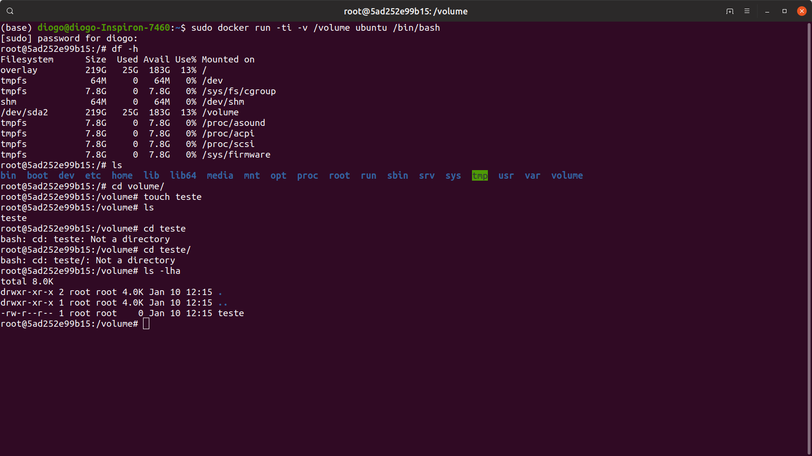
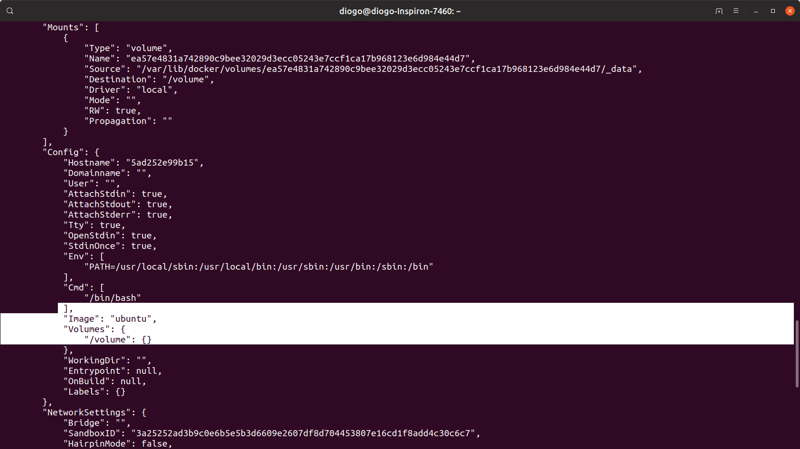
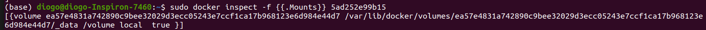
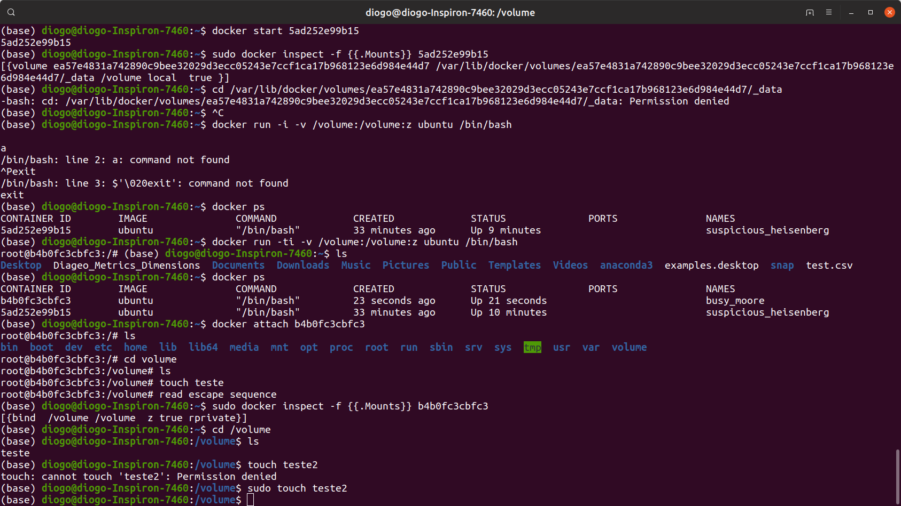
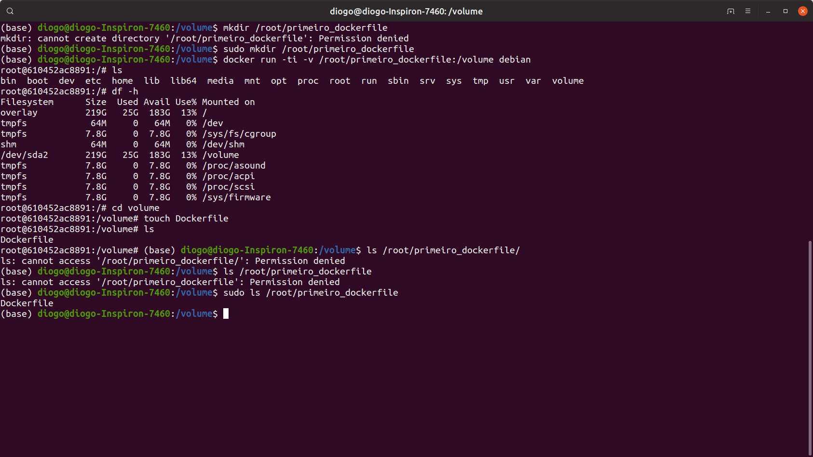
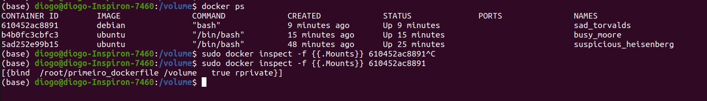
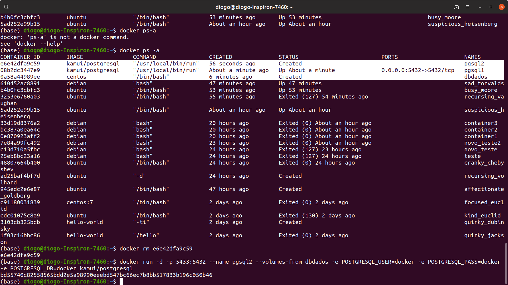
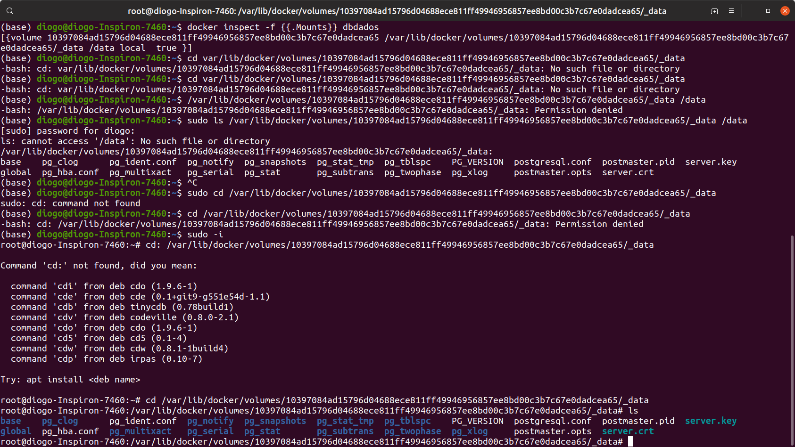

## Volumes e Container Data-Only
Volume é uma forma de adicionar um filesystem, um diretório fora do filesystem do container.  
É como se montasse um diretório dentro do host do Docker, algo parecido como mapeamento de unidades.  
Caso delete o container o volume ainda ficará presente.  

**docker run -ti -v /volume (nome da imagem):** Permite criar um volume a quantidade de uso de um container ao executá-lo.  

Um exemplo:
```
sudo docker run -ti -v /volume ubuntu /bin/bash
```
Após isso verifique os diretórios dentro do container:
```
df -h
ls
cd volume/
```


Este diretório é como se fosse um ponto de montagem, se alterar aqui altera no host e vice e versa.  

Para enxergar o diretório usa-se o *docker inspect*
Antes use o *docker ps* para pegar o ID do container.  
```
sudo docker inspect <id do container>
```
Após isso você verá o volume quando descer a barra de rolagem.  


Depois execute o comando:
```
sudo docker inspect -f {{.Mounts}} 5ad252e99b15
```
Para poder visualizar como é o caminho do diretório no container.  



Após isso tente dar um cd /local/do/volume/.  
Se der erro conforme a imagem uma alternativa é usar o comando: 
```
docker run -ti -v /volume:/volume:z ubuntu /bin/bash
```
  

### Mapeando usando um docker file
Primeiro crie um diretório em root:
```
sudo mkdir /root/primeiro_dockerfile
```

Depois execute o comando abaixo usando o caminho do diretório seguido de : e depois /volume, e o nome da imagem. 
```
docker run -ti -v /root/primeiro_dockerfile:/volume debian
```
Após isso entre  no volume e crie um arquivo usando o comando *touch Dockerfile*. 
```
ls 
df -h
cd volume/
touch Dockerfile
```
Depois saia do container sem parar sua execução *ctrl+p+q* após isso navegue a até a pasta, lá você verá o arquivo criado.  
```
sudo ls root/primeiro_dockerfile/
```

Se quiser ver o volume montado use o inspect novamente.  
```
sudo docker inspect -f {{.Mounts}} 610452ac8891
```

### Container Data Only
Container que possua apenas volumes para ser compartilhados entre os volumes.  
```
docker create -v /data --name dbdados centos
```
Após isso iremos compartilhar este volume com outros containers.  
Para isso usaremos o parametro *--volumes-from nome_volume*.

Vamos criar dois containers contendo a imagem do postgresql.  
```
docker run -d -p 5432:5432 --name pgsql1 --volumes-from dbdados -e POSTGRESQL_USER=docker -e POSTGRESQL_PASS=docker -e POSTGRESQL_DB=docker kamui/postgresql
```
Após isso o segundo container.  
```
docker run -d -p 5433:5432 --name pgsql2 --volumes-from dbdados -e POSTGRESQL_USER=docker -e POSTGRESQL_PASS=docker -e POSTGRESQL_DB=docker kamui/postgresql
```

O parametro -p é a porta que será exposta ou fechada, a primeira é a porta do host seguido de : e depois a porta do container. o -e é de environment, que é refernete as variáveis de ambiente que serão passadas.  

Agora para ver se o volume esta realmente compartilhado.  
```
docker inspect -f {{.Mounts}} dbdados
```
Após isso pegue o caminho e use o *CD /nome/do/caminho* para ir até ele, se der erro use o *sudo -i* e repita o cd.  
Abaixo um exemplo:  


---