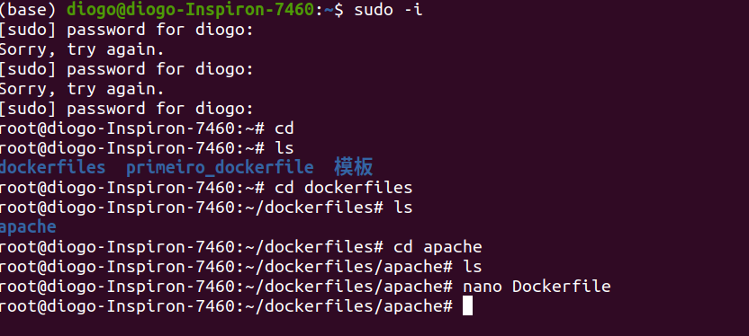
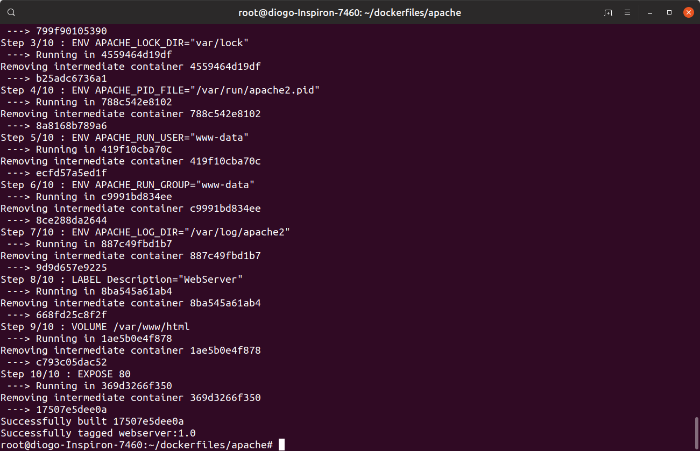
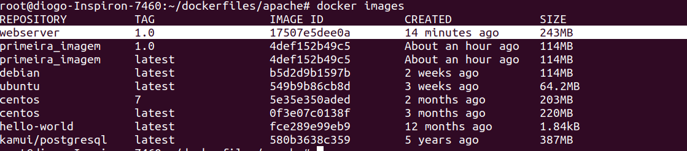
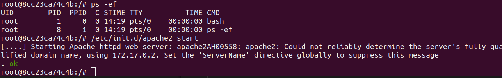
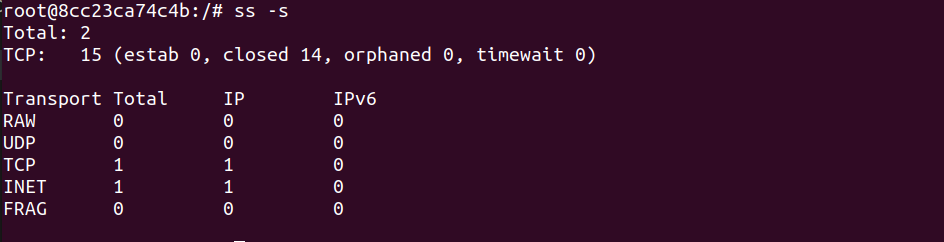
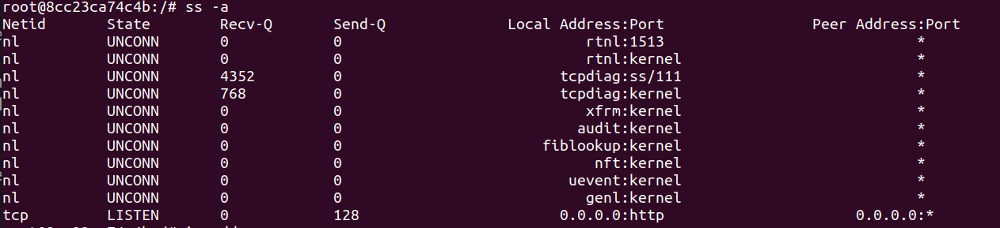
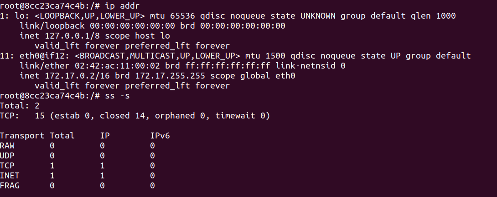
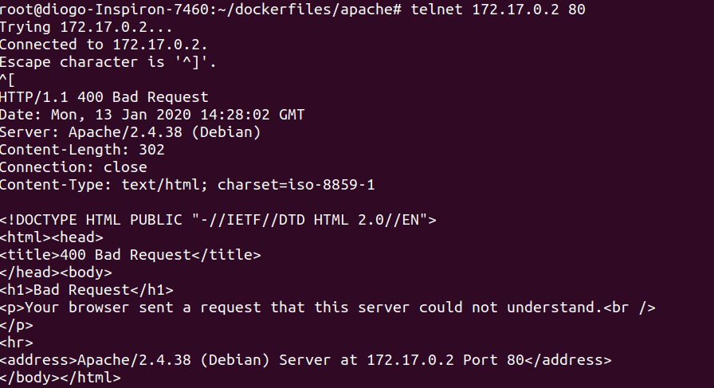
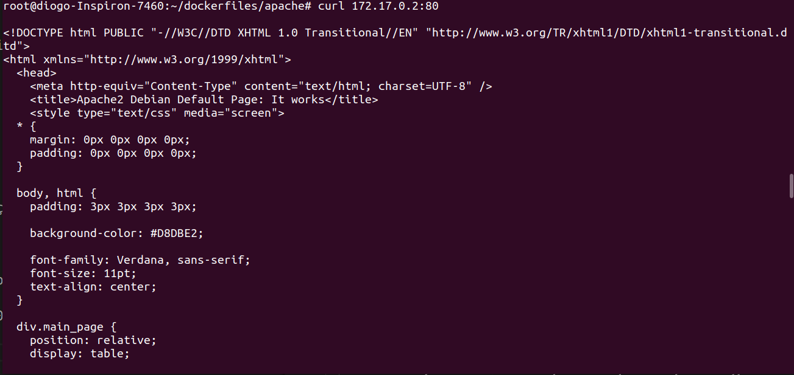

## Criando Imagens de Container Docker
*Mas afinal quais as diferenças entre imagem e container?*  

Um paralelo com orienteação a objeto seria a imagem equivalente a classe e o container equivalente ao aobjeto.  

**De forma mais completa:**  

Uma imagem é um pacote leve e executável que engloba tudo que é preciso para executar um pedaço da aplicação, incluindo código, bibliotecas, variáveis de ambiente, arquivos de configuração e um ambiente de execução.  

Um container é uma instância desta imagem, isto é, dada a configuração da imagem, é o que todo o conjunto anterior se torna em memória quando é de fato executado. Um container roda de modo isolado do host por padrão, apenas acessando arquivos do host caso haja configuração para tal.  

* Referência:  [Blog Alura ](https://cursos.alura.com.br/forum/topico-qual-e-diferenca-de-container-e-imagem-47761)


### Importância das imagens
Criar imagens permite que seja customizado as imagens que contém no dockerhub, além do fato de ter a flexibilidade para executar elas no seu ambiente.  

Requisitos:  
1. O arquivo sempre deve se chamar Dockerfile.
2. Sempre dever ser passado no parametro o diretorio, nunca o nome do dockerfile.  

Iniciaremos criando um diretório para todos os dockerfiles, e criando uma imagem para o apache.  
```
mkdir /root/dockerfiles
cd root/dockerfiles/
mkdir apache
cd apache/
vi Dockerfile
```

Caso de algum erro veja como alternativa na imagem abaixo:  
  

Digite os items abaixo no DOckerfile:
```
FROM debian
RUN apt-get update && apt-get install -y apache2 && apt-get clean
ENV APACHE_LOCK_DIR="var/lock"
ENV APACHE_PID_FILE="/var/run/apache2.pid"
ENV APACHE_RUN_USER="www-data"
ENV APACHE_RUN_GROUP="www-data"
ENV APACHE_LOG_DIR="/var/log/apache2"

LABEL Description="WebServer"

VOLUME /var/www/html

EXPOSE 80
```
Agora é hora de *buildar*:
```
docker build -t webserver:1.0 .
```
Lembrando que o . representa sempre o diretorio atual, ou no caso o diretorio que se encontra o Dockerfile, nunca deve ser passado o nome do dockerfile, sempre o diretorio.  

Obs.: o parametro -y no run permite executar o apt-get dando um yes para todas as interações com a linha de comando, lembre-se que não conseguimos fazer interações com a command line no dockerfile.  

  
Ao término teŕa uma mensagem mostrando que houve exito na execução.  

Agora hora de executar a imagem criando umc container:  
```
docker run -ti webserver:1.0
```


Ao entrar no container de um *ps -ef*, note que criamos a execução do apache e não colocamos a sua inicialização, logo não terá o processo dele em execução.  
Por enquanto vamos executar o apache e logo logo modificar a imagem, para iniciar automaticamente.  

Para executar o apache: 
```
/etc/init.d/apache2 start
```
Agora saia do container *ctrl+p+q*, e use os comandos:  
Para ver se a porta esta ok.  
```
ss -s
```

```
ss -a
```

Para pegar o endereço IP:  
```
ip addr
```

Use agora o endereço IP e a porta no comando telnet:  
```
telnet 172.17.0.2 80
```

Ou de um curl:  
```
curl 172.17.0.2:80
```


---