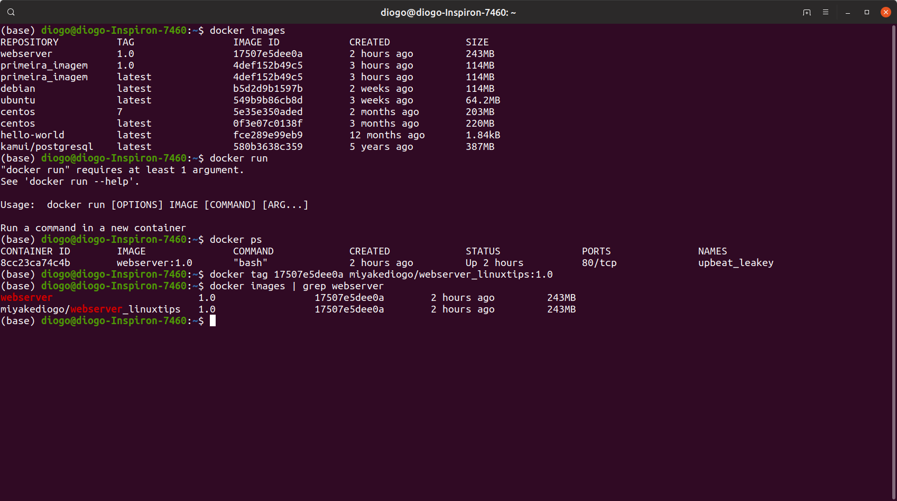
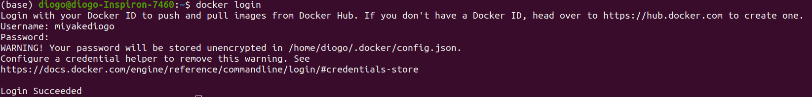
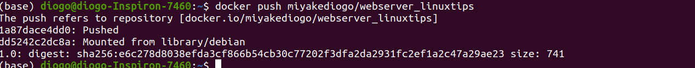
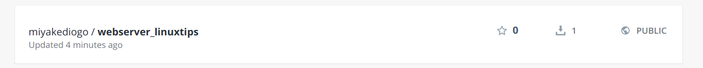
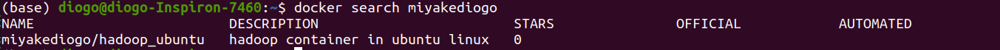
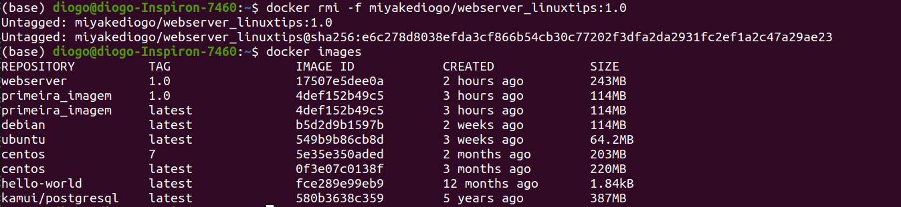
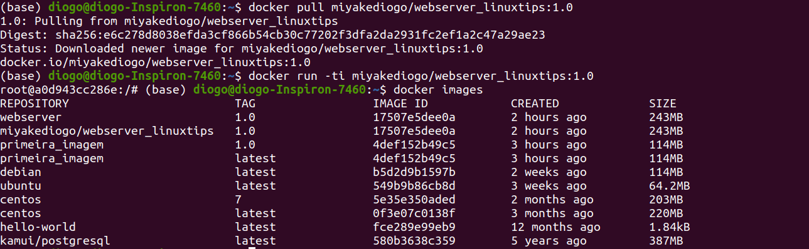

## Docker Login, Docker Push, Docker Pull e DockerHub
O DockerHub,é um repositório público e privado que permite compartilhar as imagens criadas.  
Ele é mantido pela própria docker.  

A conta gratuita permite somente um repositório privado.  

Componente *Distribution* é o responsável por armazenar as imagens e distribuí-las.  
È muito importante poder conhecer a imagem baixada para evitar possíveis problemas futuros.  
Para isso podem ser utilizados os comandos:  
* *docker inspect* 
* *docker history* (este permite ver as camadas da imagem), uma opção boa é ver o site [imagelayers](https://imagelayers.io/) que permite até ver os comandos dentro do dockerfile. 
* Outra opção é o [microbadger.](https://microbadger.com/)
* Priorizar imagens que possuam os dockerfiles, você pode copiar e colar e asim ter um melhor controle do dockerfile.  

Para subir a imagem é importante ter o **nome do usuário/nome da imagem:versao**  
Para mudar o nome da imagem:  
Use o *docker images* pegue o nome da imagem a ser modificada a tag. 
 
Use o comando *docker tag imageID nome_usuario/nomeimagem:versao*

Verifique usando o docker images.  

Após mudar o nome da imagem use o comando *docker login*.
**docker login:** Inicia o login de usuário no dockerhub, serve para dar push/pull das imagens existentes. Após usar o docker login digite seu usuário e senha.  
```
sudo docker login
```
 
**docker push nome_usuario/nome_imagem:** Permite subir sua imagem local para o dockerhub. 
```
docker push miyakediogo/webserver_linuxtips
```


Para visualizar se a imagem esta no dockerhub há duas maneiras:
1. Entre no site do dockerhub e veja se a imagem esta lá.  
2. use a linha de comando: docker search nome_usuario.
```
docker search miyakediogo
```

Agora vamos excluir a imagem local que foi feito upload para o dockerhub para podermos usar o docker pull para baixar.  

Para isso use:  
```
docker rmi -f miyakediogo/webserver_linuxtips
```

verifique usando o *docker images*.

Agora vamos fazer o pull da imagem.
**docker pull nome_usuario/nome_imagem:versao:** Permite subir sua imagem local para o dockerhub. 
```
docker pull miyakediogo/webserver_linuxtips:1.0
```
Agora é só rodar:  
``` 
docker run -ti miyakediogo/webserver_linuxtips:1.0
```


E executar a imagem.  

---