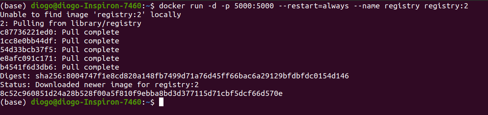
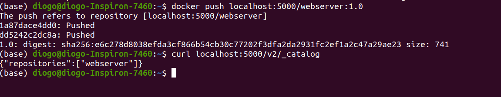

## Criando seu Docker Registry
**O que é isso? ** 
O Registry é um aplicativo do servidor sem estado e altamente escalonável, que armazena e permite distribuir imagens do Docker. O registry é de código aberto, sob a licença permissiva do [Apache.](https://en.wikipedia.org/wiki/Apache_License)  

**Por que usá-lo?**  
Você deve usar o registro se desejar:  

controlar rigidamente onde suas imagens estão sendo armazenadas possui totalmente seu pipeline de distribuição de imagens
integre firmemente o armazenamento e a distribuição de imagens no seu fluxo de trabalho de desenvolvimento interno.  

**Alternativas**  
Os usuários que procuram uma solução pronta para uso com manutenção zero são incentivados a migrar para o Docker Hub, que fornece um Registro hospedado e gratuito, além de recursos adicionais (contas da organização, compilações automatizadas e muito mais).  
**Referência:** [Documentação](https://docs.docker.com/registry/)


É muito util para ter controle e integridade de suas imagens, geralmente as empresas tem para ter um melhor controle de confiabilidade e confidencialidade de suas imagens.  

Podemos subir em uma VM ou em um container.  

Para isso usaremos o *docker run* com os parametros -d para executar como um daemon, -p para colocar a porta 5000 do registry sendo as portas *host:container*, esta próxima opção é muito importante, pois sempre que ococrrer a queda do container ele irá reiniciar automaticamente *--restart=always*. e para finalizar adicionaremos um nome e sua versão para facilitar encontrar e organizar o container, logo o comando todo fica:  
```
docker run -d -p 5000:5000 --restart=always --name registry registry:2
```

Após isso verifique se a imagem esta ok e se o container esta em execução, usando os comandos já conhecidos como o *docker ps* e *docker images*, pode usar também o *docker images | grep registry*

Agora vamos fazer o push da nossa imagem para o nosso registry local.  
Para isso usaremos o endereço do nosso registry/nome_da_imagem, para este caso será o localhost:5000 se tivesse um ip seria o IP e se fosse um dns teria um dns.  

Ficando assim:
Primeiro pegamos o ID da imagem usando:
```
docker images | grep webserver
```
Depois nós usamos o comando:
```
docker tag <id container> localhost:5000/webserver:1.0
```
Verifique se a imagem aparece :
```
docker images | grep webserver
```
Agora conseguimos fazer o push par ao registry local.

Para isso:
```
docker push localhost:5000/webserver:1.0
```

Obs.: Lembrando que este é um registry simples sem autenticação.  

Caso queira dar um Push: 

```
docker pull localhost:5000/webserver:1.0
```
Para saber quais as imagens que estão em nosso registry local podemos usar o comando:  
```
curl localhost:5000/v2/_catalog
```
  

---