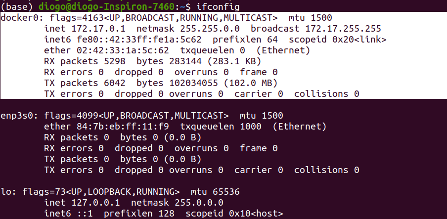
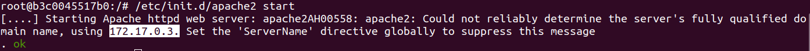
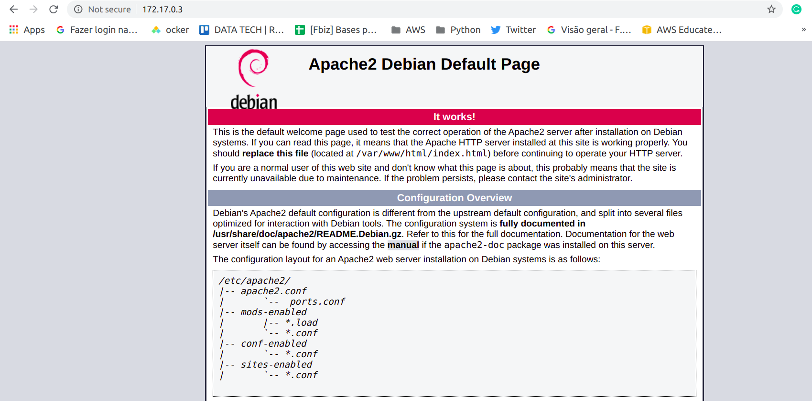
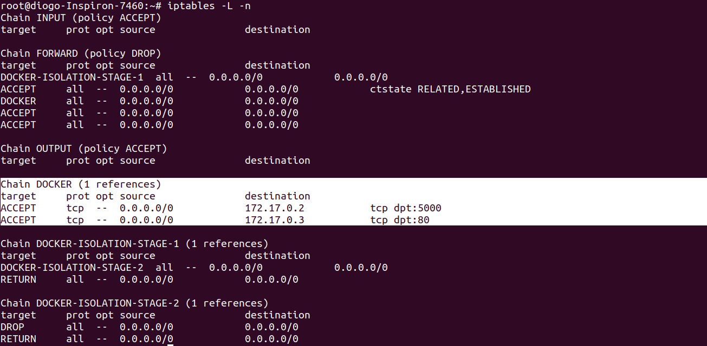
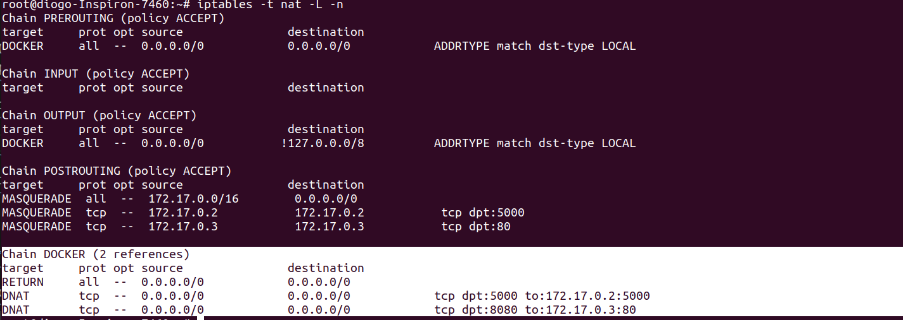

## Configurando Opções de Rede dos containers

Veremos como passar alguns parametros de rede ao criar um container.  

dokcer0 é uma bridge , toda comunicação que é feita pelos containers a sua.
use o ifcongif para visualizar, caso não tenha o net-tools installe ele
```
sudo apt install net-tools
ifconfig
```
  

Começando agora com os parametros.  
**--dns:** É passado um servidor de dns que responderá as nossas requisições.  
```
docker run -ti --dns 8.8.8.8 debian
```
**--hostname:** Coloca um hostname para o container.  
```
docker run -ti --hostname shakespirito debian
```
**--link:** Permite linkar dois containers. Exemplo suba um container, depois suba o segundo usando o parametro link com o nome do primeiro container para que o segundo possa se linkar com o primeiro.  
```
docker run -ti --name container1 debian
docker run -ti --link container1 --name container2 debian

cat /etc/hosts
```
**--expose:** Permite expor a porta do container.  
```
docker run -ti --expose 80 debian
```
**--publish:** Faz um bind/conexão da porta do container com o host.  
```
docker run -ti --publish 8080:80 debian
```
**--mac-address:** Permite personalizar o mac address do container.  
```
docker run -ti --mac-address 12:34:de:b0:6b:61 debian
```  
Vamos ver um exemplo de redirect com o publish:  
```
docker run -ti --publish 8080:80 --name webserver_new debian
```
Dentro do bash do container digite:
```
apt-get update && apt-get install -y apache2
```
Depois digite 
```
/etc/init.d/apache2 start 
```
Pegue o IP do host, usaremos ele daqui a pouco. 
  
Saia do container usando o *ctrl+p+q*
Agora vá ao browser e dite o IP. Veja que rolou o redirect e abrirá a pagina do apache dentro de seu container.  
 

Quem faz o redirect é o iptables, para verificar podemos digitar:
```
iptables -L -n
```
  
```
iptables -t nat -L -n
```
Na imagem podemos ver o redirecionamento o dnat para o destino.
  
Dica: deixar o docker gerenciar essas regras é mais fácil e mais saudável para você.  

**--net-host:** Com o parametro host o stack de network a ser usado será do host e não do container (como no caso padrão que usa o docker0 como bridge). Basicamente é como se compartilhasse o stack de network do host com o do container.  
```
docker run -ti --net-host debian
```
---