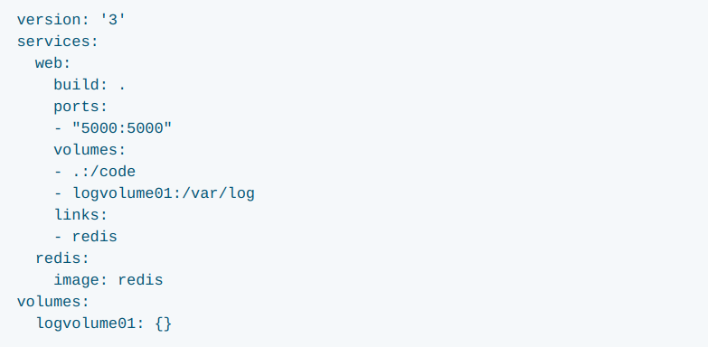
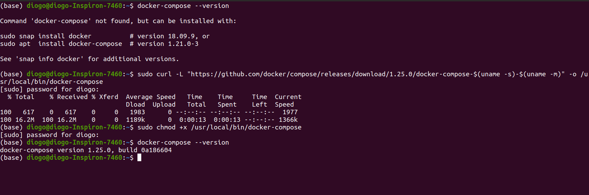

## Docker Compose
Serve para containizar o ambiente, em um unico arquivo é possivel adicionar todas as criações de containers necessárias em um único arquivo.  
O compose também facilita o escalamento de containers.  

**Abaixo a definição da documentação:** 

O Compose é uma ferramenta para definir e executar aplicativos Docker de vários contêineres. Com o Compose, você usa um arquivo YAML para configurar os serviços do seu aplicativo. Em seguida, com um único comando, você cria e inicia todos os serviços da sua configuração. Para saber mais sobre todos os recursos do Compose, [consulte a lista de recursos.](https://docs.docker.com/compose/#features)  

 

O Compose funciona em todos os ambientes: produção, preparo, desenvolvimento, teste e fluxos de trabalho de IC. Você pode aprender mais sobre cada caso em [Casos de Uso Comuns.](https://docs.docker.com/compose/#common-use-cases)

O uso da composição é basicamente um processo de três etapas:

1. Defina o ambiente do seu aplicativo com um Dockerfile para que ele possa ser reproduzido em qualquer lugar.
2. Defina os serviços que compõem seu aplicativo no docker-compose.yml para que possam ser executados juntos em um ambiente isolado.
3. Execute o docker-componha e o Compose inicia e executa todo o aplicativo.

* Referências: [Overview docker compose](https://docs.docker.com/compose/)

Um exemplo do docker compose yaml:  
 

Agora vamos instalar o docker compose, para isso siga os passos na [documentação.](https://docs.docker.com/compose/install/)  
Ficará assim na linha de comando:  
  

Abaixo a lista de alguns parametros do **docker-compose.yaml**:

**build:** Indica o caminho do Dockerfile.
```
build: .
```
**command:** Executa um comando.
```
command: bundle exec thin -p 3000
```
**container_name:** Nome para o container.
```
container_name: my_container
```
**dns:** Indica o dns server.
```
dns: 8.8.8.8
```
**dns_search:** Especifica um search domain.
```
dns_search: example.com
```
**dockerfile:** Especifica um Dockerfile alternativo.
```
dockerfile: Dockerfile-alternate
```
**env_file:** Especifica um arquivo com variáveis de ambiente.
```
env_file: .env
```
**environment:** Adiciona variáveis de ambiente.
```
environment: 
    RACK_ENV: development
```
**expose:** Expõe a porta do container.
```
expose: 
- "3000"
- "8000"
```
**external_links:** Linka containers que não estão especificados no docker compose atual.
```
external_links: 
- "redis_1"
- "project_db_1:mysql"
```
**extra_hosts:** Adiciona uma entrada no /etc/hosts do container.
```
extra_hosts: 
- "somehost":162.242.195.82
- "otherhost":50.31.209.229
```
**image:** Indica uma imagem.
```
image: ubuntu: 18.10

```
**labels:** Adiciona metadata ao container.
```
labels: 
com.example.description: "Accounting webapp"
com.example.department: "Finance"
```
**links:** Linka containers dentro do mesmo docker compose.
```
links: 
- db
- db:database
```
**log_driver:** Indica o formato do log a ser gerado, por ex: syslog, json-file, etc.
```
log_driver: syslog

OU

logging:
driver: syslog

```
**log_opt:** Indica mandar os logs, pode ser local ou em um syslog remoto.
```
log_opt: 
syslog-address: "tcp://192.168.0.42:123"

OU 

logging:
driver: syslog

```
**net:** Modo de uso da rede.
```
net: "bridge"
net: "host"

```
**ports:** Expõe as portas do container e do host.
```
ports: 
- "3000"
- "8000:8000"
```
**volumes, volume_driver:** Monta volumes no container.
```
volumes: 
    # Especificar o caminho e deixe o mecanismo criar um volume
    - /var/lib/mysql
    # Especificar o caminho absoluto
    - /opt/data:/var/lib/mysql
    # Especificar o caminho do host relativo ao compose file
    - ./cache:/tmp/cache
```
**volumes_from:** Monta volumes através de outro container.
```
volumes_from: 
- service_name
- service_name:ro
```

### Hora de por a mão na massa com o docker-compose.

Crie a pasta *compose_test*, usando o comando mkdir. 
```
mkdir compose_test
cd compose_test
```
Entre na pasta e crie o arquivo *docker-compose.yaml*, entre no arquivo e digite os itens abaixo dentro do arquivo.  
```
version: '3'
services:
  web:
    build: .
    ports:
      - "5000:5000"
  redis:
    image: "redis:alpine"
```
Crie o arquivo app.py e digite os comandos abaixo

```
import time

import redis
from flask import Flask

app = Flask(__name__)
cache = redis.Redis(host='redis', port=6379)


def get_hit_count():
    retries = 5
    while True:
        try:
            return cache.incr('hits')
        except redis.exceptions.ConnectionError as exc:
            if retries == 0:
                raise exc
            retries -= 1
            time.sleep(0.5)


@app.route('/')
def hello():
    count = get_hit_count()
    return 'Hello World! I have been seen {} times.\n'.format(count)
```


Agora criaremos o *Dockerfile*, digite estes campos nele:
```
FROM python:3.7-alpine
WORKDIR /code
ENV FLASK_APP app.py
ENV FLASK_RUN_HOST 0.0.0.0
RUN apk add --no-cache gcc musl-dev linux-headers
COPY requirements.txt requirements.txt
RUN pip install -r requirements.txt
COPY . .
CMD ["flask", "run"]
```
Isso diz ao Docker para:

* Criar uma imagem começando com a imagem Python 3.7.
* Defina o diretório de trabalho como / code.
* Defina variáveis de ambiente usadas pelo comando flask.
* Instale o gcc para que pacotes Python, como * MarkupSafe e SQLAlchemy, possam compilar acelerações.
* Copie requirements.txt e instale as dependências do Python.
* Copie o diretório atual. no projeto para a workdir. na imagem.
* Defina o comando padrão para o contêiner executar a execução do balão.


Agora criaremos o *requirements.txt* adicionando as bibliotecas que usaremos no ambiente: 
```
flask
redis
```
Este arquivo de composição define dois serviços: web e redis.  

Para subir o container em nosso ambiente digite: 

```
docker-compose up
```

Para visualizarmos a aplicação executando entre no navegador e digite o endereço:  http://localhost:5000/.  


Para ver se os containers use o *docker-compose ps*.  

Para escalar use o *docker-compose scale nome do container=quantidade*.  

Para parar o compose use *docker-compose stop*.

Para iniciar o compose use *docker-compose start*.

Para ver os logs do compose use *docker-compose logs*.  

Referências: [Get Started](https://docs.docker.com/compose/gettingstarted/)  
