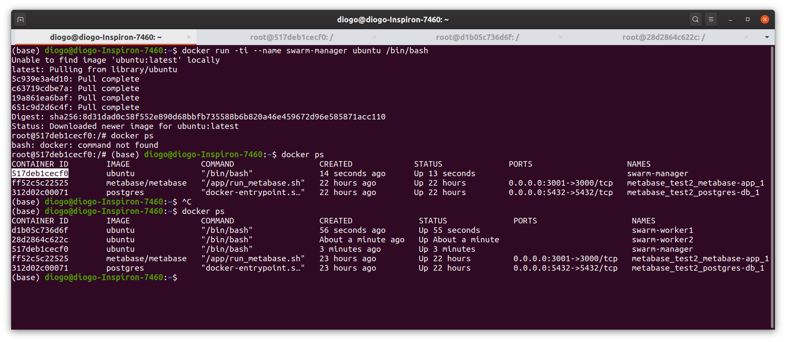

## Orquestração com o Docker
O Swarm mode do docker é uma ferramenta disponível a partir da versão 1.12 que permite gerenciar e orquestrar diversos containers, ele consiste em usar um manager e quantos workers forem necessários, para que o serviço seja executado.  

**Referências:**
* [Swarm Key Concepts](https://docs.docker.com/engine/swarm/key-concepts/)
* [Swarm Tutorial](https://docs.docker.com/engine/swarm/swarm-tutorial/) 

Será necessário três máquinas para poder estar vendo como o swarm funciona.  

Primeiro vamos criar 3 máquinas ubuntu, para isso use os comandos abaixo: 
* Docker swarm manager
```
docker run -ti --name swarm-manager ubuntu /bin/bash
```
* Swarm workers
```
docker run -ti --name swarm-worker1 ubuntu /bin/bash
```
```
docker run -ti --name swarm-worker2 ubuntu /bin/bash
```
Para facilicar o uso crie mais duas abas no terminal para facilitar a continuar a usar o terminal.  

  

Para ver os ip's das maquinas:  

*docker inspect -f '{{range .NetworkSettings.Networks}}{{.IPAddress}}{{end}}' container_name_or_id*

Pegue o IP da maquina do manager e use o comando abaixo para iniciar o swarm com o ip do manager: 
```
docker swarm init --advertise-addr <ip addres>
```


---