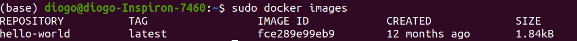
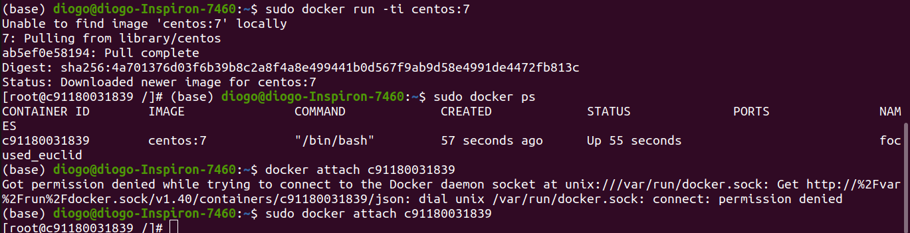
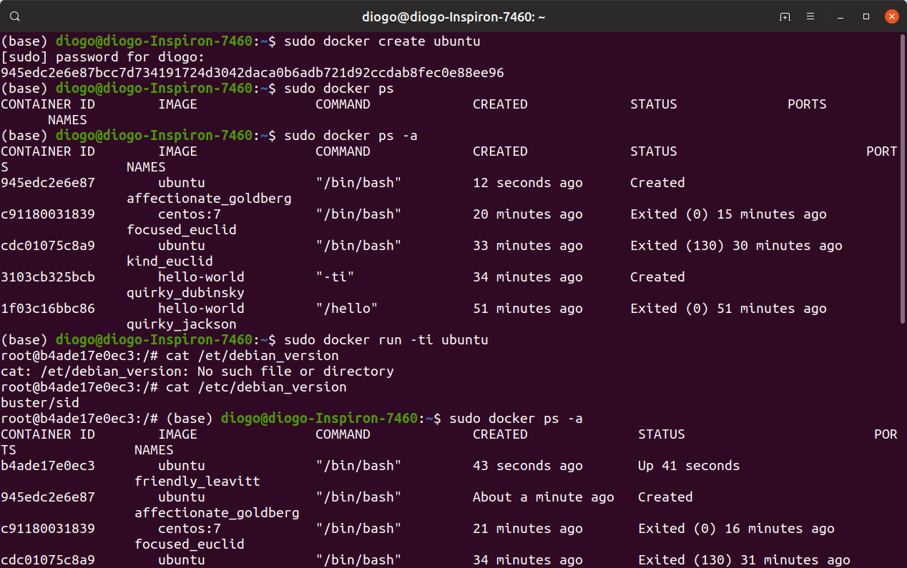
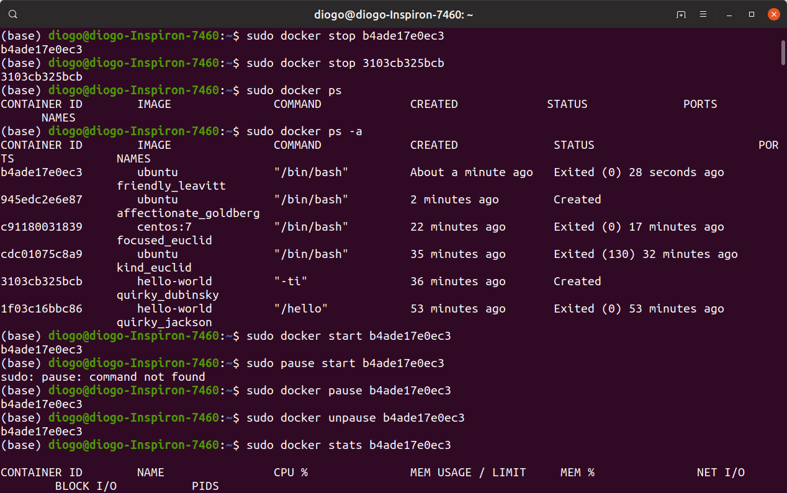
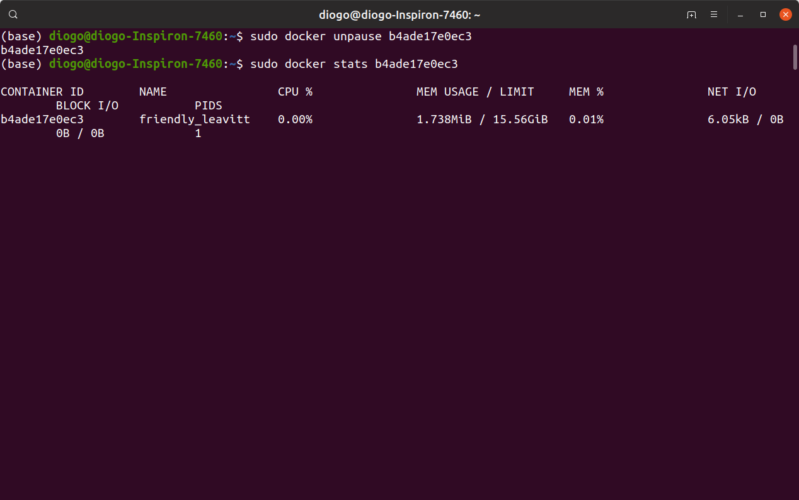
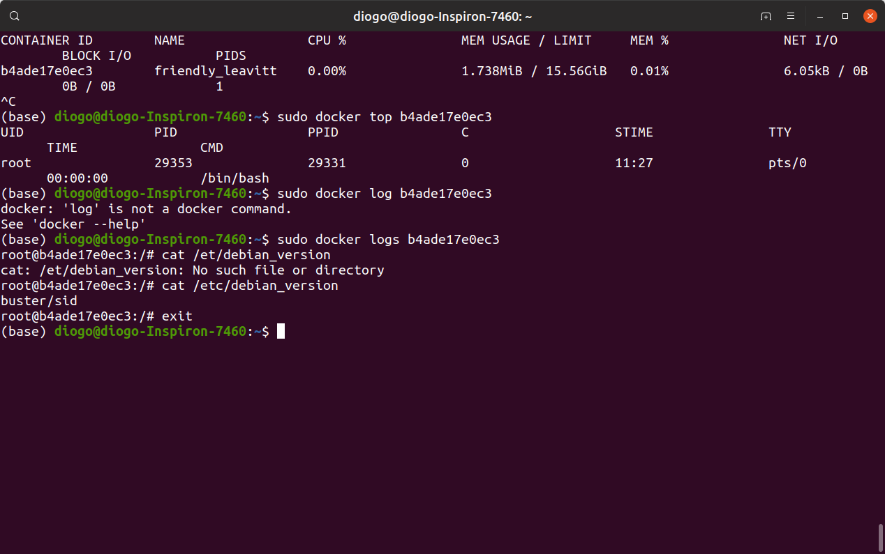
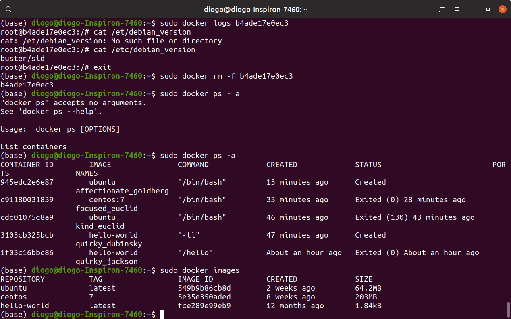

## Administrando Containers Docker
Agora começa a ficar interessante. 
**docker run:** Inicia uma imagem do container. Caso a imagem não exista o docker verifica no docker-hub e executa a imagem.  
```
sudo docker run hello-world
```
**docker ps:** Mostra todos os comandos em execução.
``` 
sudo docker ps 
```
**docker images:** Mostra todas as imagens do container.
``` 
sudo docker images 
```
Será mostrado algo como na imagem abaixo:

As informações trazidas são:  
REPOSITORY: Nome da imagem.  
TAG: Versão da imagem.  
IMAGE ID: Identificação da imagem.  
CREATED: Data de criação.  
SIZE: Tamanho da imagem.  

**docker ps -a:** Mostra todos os containers da máquina, que foram executados, parados, deram erros, etc.  
```
sudo docker ps -a
```
As informações trazidas são:  
CONTAINER ID: Identificação do container.  
IMAGE: Nome da Imagem.  
COMMAND: Nome do comando.  
CREATED:  Data de criação.  
STATUS:  Status da execução. (exito, erro)  
PORTS: Se existe alguma porta utilizada pelo container.  
NAMES: Nome do container.  

**docker run -ti:** O T é para um terminal de console e o I para a interação com o container.  
```
sudo docker run -ti ubuntu /bin/bash
```
Após isso será baixado a imagem e entrará no terminal, para sair do terminal interativo, basta digitar *exit*.  

**docker run -d:** O container roda como um processo em segundo plano.  
Para o mesmo exemplo anterior a imagem será executada mas não terá a interação.  
```
sudo docker run -d ubuntu /bin/bash
```
Outro exepmlo é pedir a versão da imagem, como no exemplo abaixo:
```
sudo docker run -ti centos:7
```
Para verificar a versão use o comando cat.  
```
cat /etc/redhat-release
```
Como o Shell é o processo principal desta imagem se apertar *ctlr+d* além de sair do shell será feito um kill na imagem, para poder sair do shell sem matar a imagem, use o *ctrl+pq*. Basta usar um docker ps para poder ver o container em execução.  
E se eu quiser retornar a imagem? Para isso use o comando *docker attach  + id do container*.  

**docker attach (container id):** Use docker attach para anexar a entrada, saída e erro padrão do seu terminal (ou qualquer combinação dos três) a um contêiner em execução usando o ID ou nome do contêiner. Isso permite que você veja a saída em andamento ou a controle interativamente, como se os comandos estivessem sendo executados diretamente no seu terminal.

```
sudo docker attach c91180031839
```
Fica assim tudo:  
  

**docker create (nome do container):** Cria o container mas não o inicia.  
```
sudo docker create ubuntu
```
O container será criado mas não será inicializado para isso use o *docker run* com o -ti, se quiser ver a versão do ubuntu do container use *cat /etc/debian_version*.  

**docker stop (id do container):** Irá parar o container.  
```
sudo docker stop b4ade17e0ec3
```
Para verificar se parou o container use o *docker ps* ou *docker ps -a*.  
Abaixo a lista de mais alguns comandos:  
**docker start (id do container):** Irá iniciar o container.  
```
sudo docker start  b4ade17e0ec3
```
**docker pause (id do container):** Irá congelar o container.  
```
sudo docker pause  b4ade17e0ec3
```
**docker unpause (id do container):** Irá descongelar o container.  
```
sudo docker unpause  b4ade17e0ec3
```
**docker stastatsrt (id do container):** Irá mostar as estatisticas de uso de recursos do container.  
```
sudo docker stats  b4ade17e0ec3
```
**docker logs (id do container):** Irá gerar os logs de execução do container.  
```
sudo docker logs  b4ade17e0ec3
```
**docker rm (id do container):** Irá remover o container.(tem de parar a execução do container)  
```
sudo docker rm  b4ade17e0ec3
```
**docker rm -f (id do container):** Irá remover o container de forma forçada.(Em caso de o container estiver em execução)  
```
sudo docker rm -f b4ade17e0ec3
```
Abaixo as imagens: 

  

  

  

  
Note que mesmo removendo o container as imagens permanecem.  

  

---