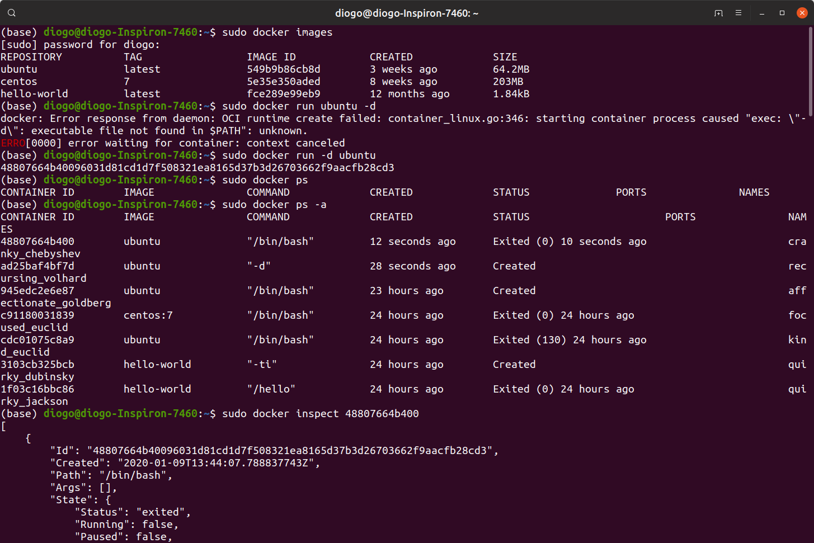
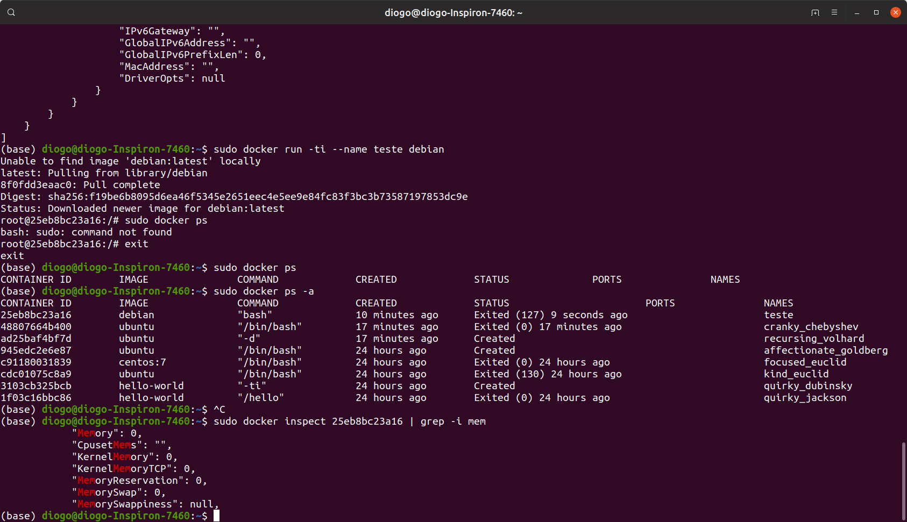
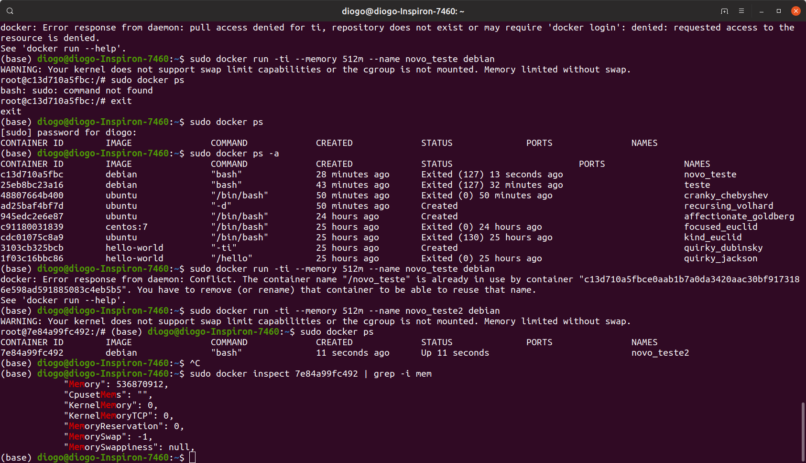
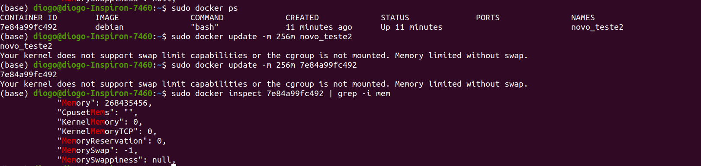
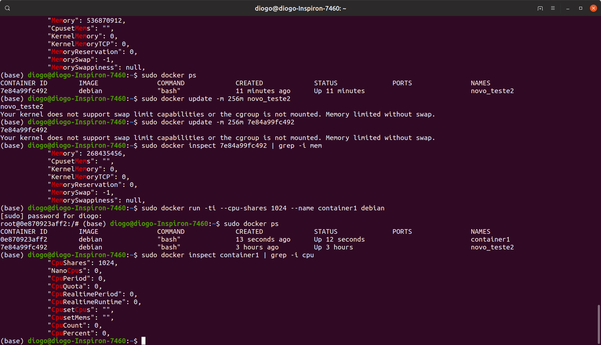
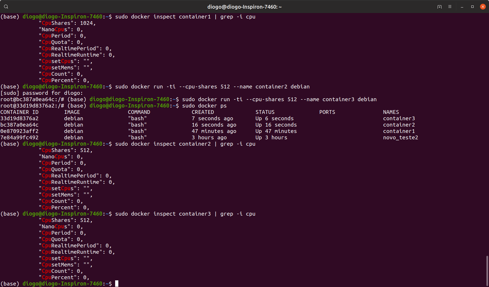
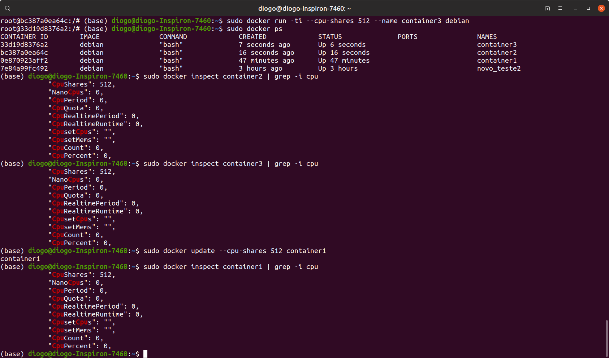

## Limitando CPU e MEMÓRIA dos Containers
Limitar o uso de CPU e memória é importante para não sobrecarregar o SO.  
Além de comprometer outros containers e recsabe me informar quem dai

### Limitando a Memória
**docker inspect (id do container):** Permite visualizar detalhes do container em execução.  

```
sudo docker inspect 48807664b400
```
Após isso serão mostrados todos os recursos usados pelo container.  
 
Antes de adicionar o limite na memória iremos executar o comando abaixo:  
```
sudo docker run -ti --name teste debian
```
O parâmetro *--name* permite dar um nome ao container.  
Use o docker ps para pegar o container ID e execute o comando: 
```
sudo docker inspect <container_id> | grep -i mem
```  

  

Agora que foi mostrado os campos referentes a memória, vamos adicionar o limite de memória, para isso use:  
```
sudo docker run ti --memory 512m --name novo_teste debian
```
O parâmetro *-m* ou *--memory* é que permite adicionar um limite de memória ao container.  

Após isso pegar o container id novamente e reutilizar o comando anterior.  

 

Para alterar a memória de um container em execução, sua-se o docker update.

**docker update -m (quantidade e memoria) (id do container):** Permite alterar a memória de um container em execução.  

```
sudo docker update -m 256m novo_teste2
```
Note que pode ser usado o nome do container ao invés do container id. 

Depois iremos rever com o inspect.  
 
Note que deu certo a limitação da memória para o container.  

### Limitando a CPU  

Agora iremos limitar a CPU.  
Exemplo, se eu tenho três containers ao qual a divisão de CPU no docker é feita por pesos que vai de 1 a 1024, portanto se colocarmos 1024, 512 e 512, teremos o primeiro container com maior prioridade entre todos.  

**docker run -ti --cpu-shares 1024 --name (nome deo container) (imagem):** Permite colocar a quantidade de uso de um container ao executá-lo.  

Para verificar a atribuição de CPU
```
sudo docker inspect container1 | grep -i cpu
```
  

Após isso criar o container2 e 3 com 512 cpu shares cada.  



Para modificar com o container em execução basta usar o docker updates.  

```
sudo docker update --cpu-shares 512 container1
```
Assim fica atualizado o container1.


Está é uma das formas de dividir o processamento entre os containers.

---