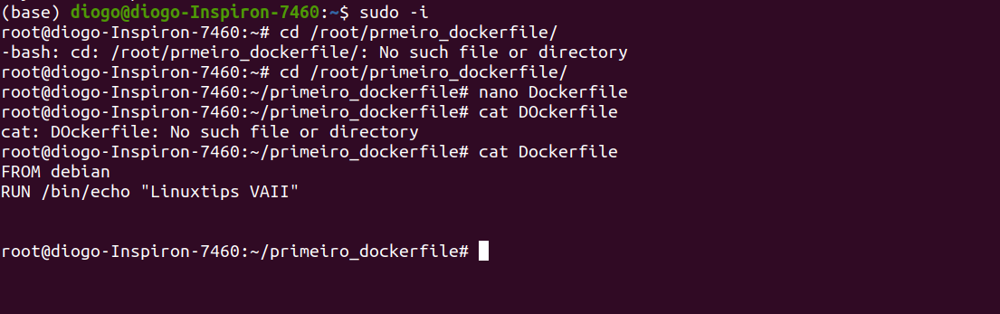
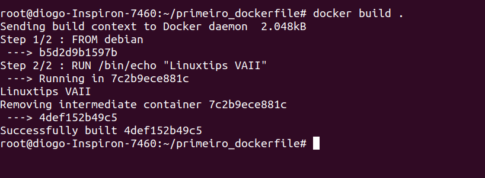
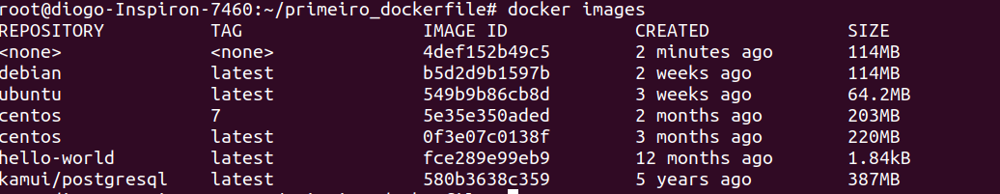
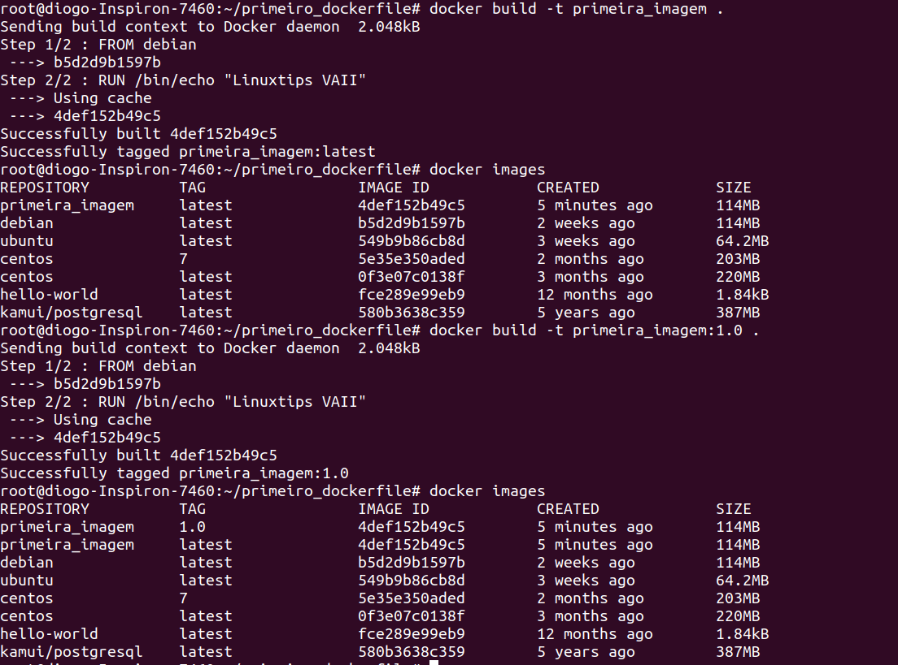

## Mais DockerFile e Build!
Continuando de onde paramos, caso não tenha ainda entrado no dockerfile, entre agora: 
```
sudo cd /root/primeiro_dockerfile/
```
Para acessar o Dockerfile, use o editor vi ou o nano:
```
vi Dockerfile
```
Escreva *FROM debian* de um espaço e escreva *RUN /bin/echo "Linuxtips Vaiii!"*.  

Para fazer o deploy do dockerfile use o docker build.  
**docker build . :** Constrói o container a partir do dockerfile. Usando o ponto "." ele usa o dockerfile a partir do diretorio corrente. Para mais [informações](https://docs.docker.com/engine/reference/commandline/build/).
```
docker build .
```


Para ver as imagens use o *docker images*, note que duas imagens estão com o none no nome. Isso ocorre devido a não taguearmos esta imagem.  



Para fazer da forma correta: 
```
docker build -t primeira_imagem:1.0 .
```
O parametro -t permite taguear a imagem, onde o 1.0 representa a versão, ele irá ter esta na TAG, veja conforme a imagem abaixo.  


---
