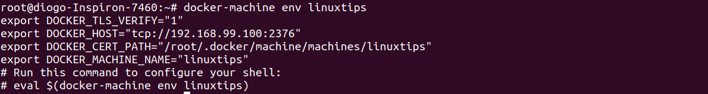
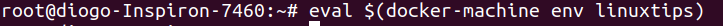
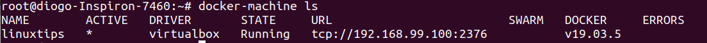
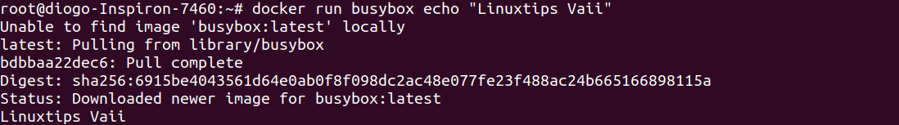
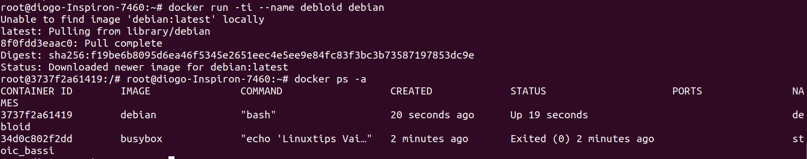
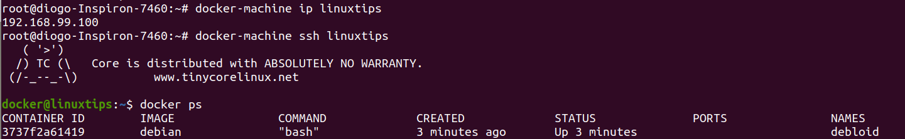
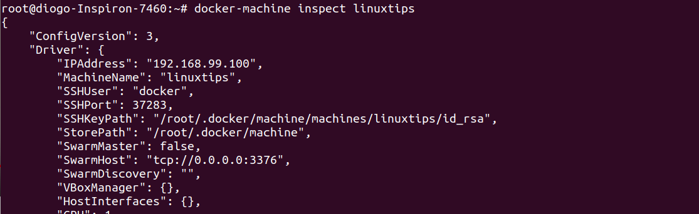
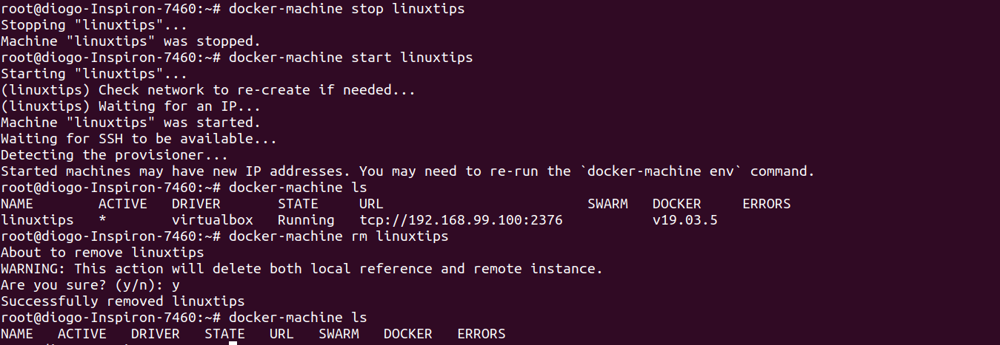

## Docker Machine - Instalação do Docker Host
O Docker machine permite criar host docker e executar em diversos virtualizador ou cloud.  
Assim você consegue gerenciar seus containers a partir de seu pc.  

Referências:  
* [Documentação](https://docs.docker.com/v17.09/machine/overview/#why-should-i-use-it)
* [Instalação](https://docs.docker.com/v17.09/machine/install-machine/#install-machine-directly)  
* [Get-Started](https://docs.docker.com/v17.09/machine/get-started/)


Primeiro devemos instalar o docker machine, para isso digite o comando abaixo no terminal:  
```
curl -L https://github.com/docker/machine/releases/download/v0.13.0/docker-machine-`uname -s`-`uname -m` >/tmp/docker-machine && \
chmod +x /tmp/docker-machine && \
sudo cp /tmp/docker-machine /usr/local/bin/docker-machine
```
Caso não tenha o [virtualbox](https://www.virtualbox.org/wiki/Linux_Downloads) instale ele para poder usar.  

Agora iremos começar a o docker machine.  
Iremos criar um driver para a plataforma que iremos gerenciar o container, usando o parametro --driver em seguida o driver desejado seguido do nome do hostdocker a ser criado.

```
docker-machine create --driver virtualbox linuxtips
```
Após isso pode-se usar o *docker-machine ls* para ver as maquinas criadas/hosts.  

Assim que usar o comando abaixo o docker trará as variaveis. 
```
docker-machine env linuxtips
```

Agora devemos executar o comando eval que o terminal nos indica. 
```
eval $(docker-machine env linuxtips)
```


A partir disso estaremos conectados no daemon do hostdocker creiado.  

Para confirmarmos que estamos no host, basta dar um *docker ps*, estará em branco já que não criamos nada nele.  

Digite o comando abaixo para ver nossos hosts disponiveis.  
```
docker-machine ls
```


Agora vamos ver um exemplo:  
```
docker run busybox echo "Linuxtips Vaii"
```


Caso queiramos executar um container como o debian.  
```
docker run -ti --name debloid debian
```
Depois de um *docker ps -a*.


### Abaixo alguns dos parametros do docker machine 

**ip:** Mostra o Ip dp host docker.  
```
docker-machine ip linuxtips
```
**ssh:** Conecta ao hostdocker usando ssh.  
```
docker-machine ssh linuxtips
```

**inspect:** mostra as informações sobre o host criado.  
```
docker-machine inspect linuxtips
```


**stop:** Para a maquina no local onde ela esta alocada
```
docker-machine stop linuxtips
```
**start:** Inicia a maquina no local onde ela esta alocada.
```
docker-machine start linuxtips
```
E se eu quiser saber o estado da máquina?  
Usamos o *docker-machine ls*

**rm:** remove a hostdocker desejado.
```
docker-machine rm linuxtips
```
  

---