## Orquestração com o Docker
O Swarm mode do docker é uma ferramenta disponível a partir da versão 1.12 que permite gerenciar e orquestrar diversos containers, ele consiste em usar um manager e quantos workers forem necessários, para que o serviço seja executado.  

**Referências:**
* [Swarm Key Concepts](https://docs.docker.com/engine/swarm/key-concepts/)
* [Swarm Tutorial](https://docs.docker.com/engine/swarm/swarm-tutorial/) 
* [linxtips](https://www.youtube.com/watch?v=IYfSWOrSWRE&list=PLf-O3X2-mxDkiUH0r_BadgtELJ_qyrFJ_&index=23)

## Não esqueça de rodar os comandos como root

## Iniciando
Será necessário três máquinas para poder estar vendo como o swarm funciona.  

Primeiro vamos criar 3 máquinas virtuais ubuntu ou debian, depois instalar o docker nelas. Usei o GCP para a criação delas, ao pegar o IP use o interno de cada máquina.  

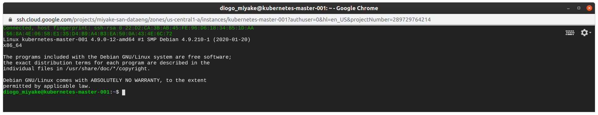
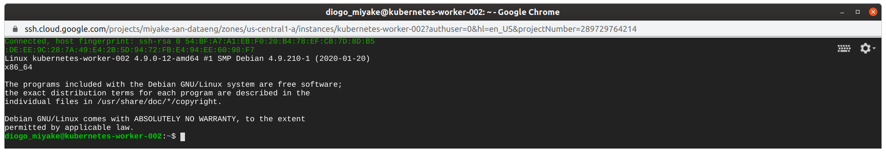
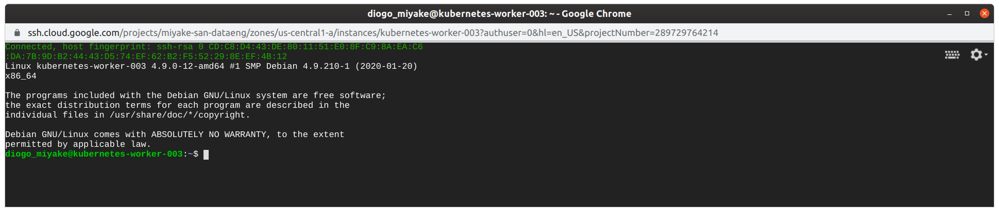

Para ver os ip's das maquinas:  

*docker inspect -f '{{range .NetworkSettings.Networks}}{{.IPAddress}}{{end}}' container_name_or_id*

Pegue o IP da maquina do manager e use o comando abaixo para iniciar o swarm com o ip do manager: 
```
docker swarm init --advertise-addr <ip addres>
```
Após isso o docker irá gerar o comando docker swarm join que será necessário colocar nas maquinas workers para se ligarem no manager. 
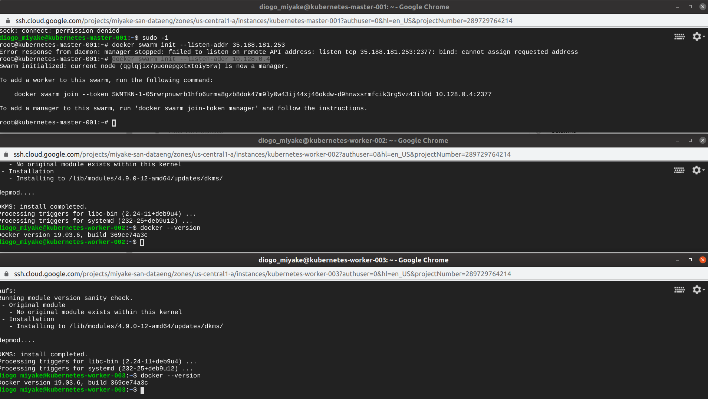
Para ver que somente a uma máquina executando, use o comando *docker node ls*. Você verá somente o manager.  
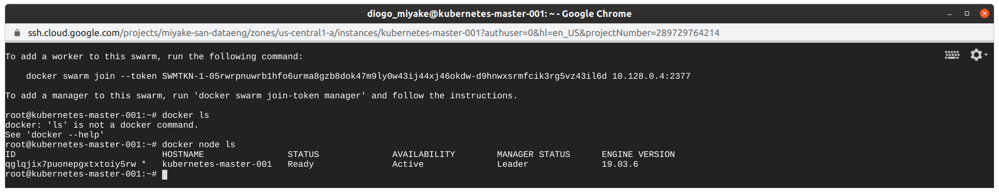
O comando será parecido com este:
```
docker swarm join --token SWMTKN-1-05rwrpnuwrb1hfo6urma8gzb8dok47m9ly0w43ij44xj46okdw-d9hnwxsrmfcik3rg5vz43il6d 10.128.0.4:2377
```

Após colocar o comando acima nos workers, teremos nosso cluster criado.  
para ver ele basta usar o comando *docker node ls* para ver os containers que fazem parte dele.  
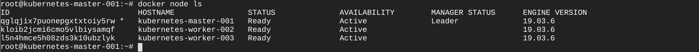
## Subindo imagem do Mysql e WordPress nos containers

### Instalando o Mysql
Execute o comando no Master:
```
docker service create --network ingress --name mysql --env MYSQL_ROOT_PASSWORD=wordpress --env MYSQL_DATABSE=wordpress --env MYSQL_USER=wordpress --env MYSQL_PASSWORD=wordpress mysql:5.7
```

Se der o seguinte erro:  
"Error response from daemon: rpc error: code = InvalidArgument desc = Service cannot be explicitly attached to the ingress network "ingress""

Faça o seguinte:
```
docker network create -d overlay my-ingress
```
Reexecute trocando o network.  
```
docker service create --network my-ingress --name mysql --env MYSQL_ROOT_PASSWORD=wordpress --env MYSQL_DATABSE=wordpress --env MYSQL_USER=wordpress --env MYSQL_PASSWORD=wordpress mysql:5.7
```

Para ver os serviços: 
```
docker service ls
```
### Instalando o Wordpress
```
docker service create --network my-ingress --name wordpress --env WORDPRESS_DB_HOST=mysql:3306 --env WORDPRESS_DB_PASSWORD=wordpress --publish 8000:80 wordpress:latest
```
Para acessar via browser é importante ter a porta aberta no firewall.  

Para liberar portas no Firewall de seu servidor Linux, utilize o comando "iptables".

A sintaxe para uso é a seguinte: iptables -I INPUT -p tcp --dport 80 -j ACCEPT
INPUT: a direção do tráfego (INPUT = ENTRADA).
-p: o protocolo utilizado pela porta (no caso tcp/udp).
--dport: o número da porta onde o tráfego irá passar (80, 443, 6667).

Caso queira liberar uma porta UDP para um jogo, SA:MP por exemplo:
iptables -I INPUT -p udp --dport 8000 -j ACCEPT

Caso queira liberar uma porta TCP para Minecraft:
iptables -I INPUT -p tcp --dport 8000 -j ACCEPT

Caso queira simplesmente liberar todo o tráfego em todas as portas:
iptables -F; iptables -X

**GCP:** Para o GCP tem de ser liberado em [regras de firewall](https://cloud.google.com/vpc/docs/using-firewalls?hl=pt-br)  

Agora basta colocar o ip:porta no browser para ver o wordpress.  

Obs.: No GCP além das regras de firewall use o external ip:8000 sem o https, somente o http.  

Ao acessar você tera uma visualização como da tela abaixo.  
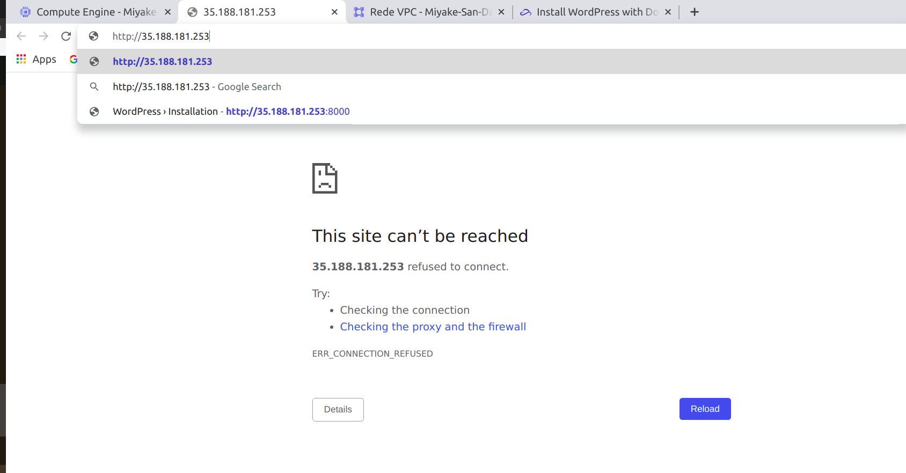
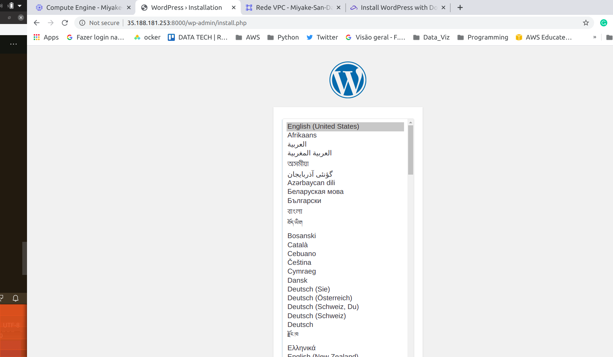

## Replicação 
 Vamos criar um serviço do nginx.  
```
docker service create --name nginx nginx
```
Agora veja usando o *docker service ls.*  
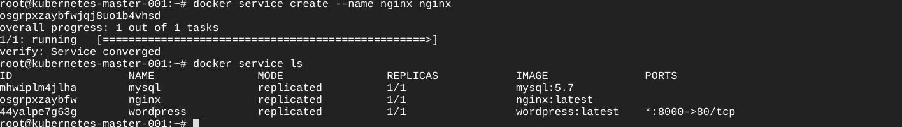  

Vamos criar as replicas.

```
docker service scale nginx=6
```
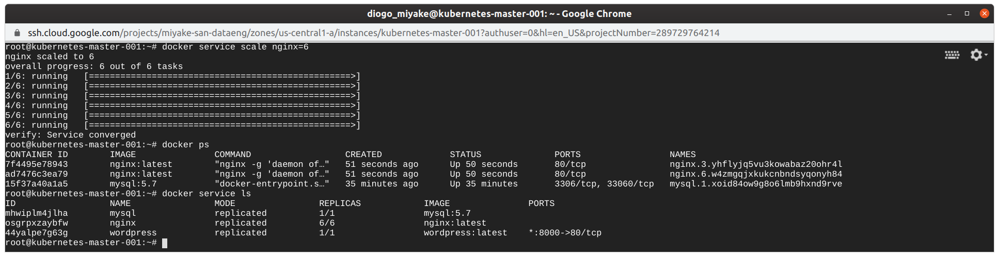
Use o *docker service ls* e você verá que agora temos 6 containers do nginx sendo distribuidos entre os workers.  
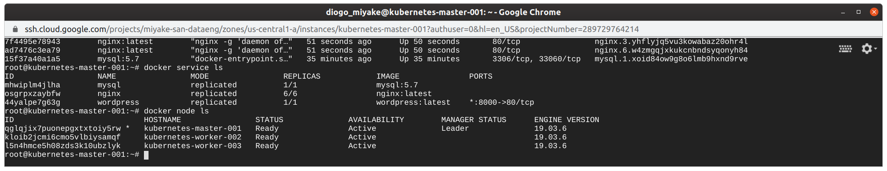

Abaixo mais alguns comandos:  

**docker inspect {container ou contianer id}:** Mostra as informações do container.  

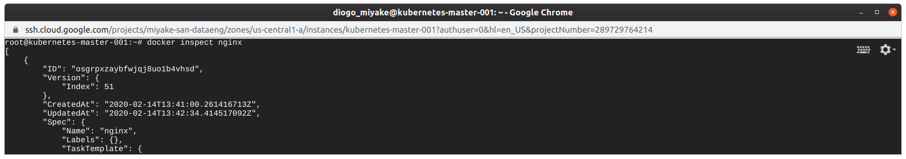

**docker inspect node {container ou contianer id}:** Mostra as informações dos nós dos containers.  

**docker service ps {service-name}:** Mostra informações de como os serviços dos containers estão sendo executados.  
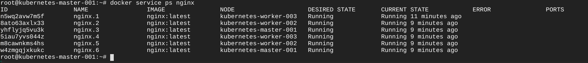

**docker network ls:** Lista as redes existentes no docker.  

---